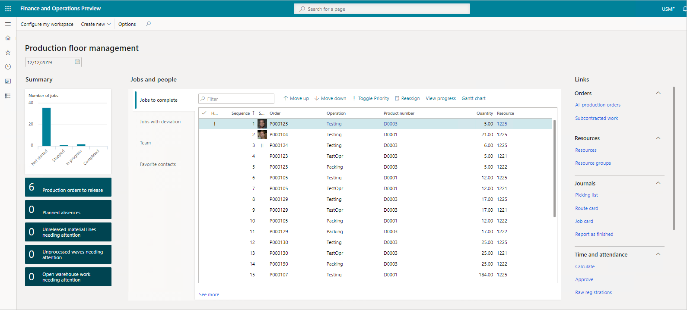
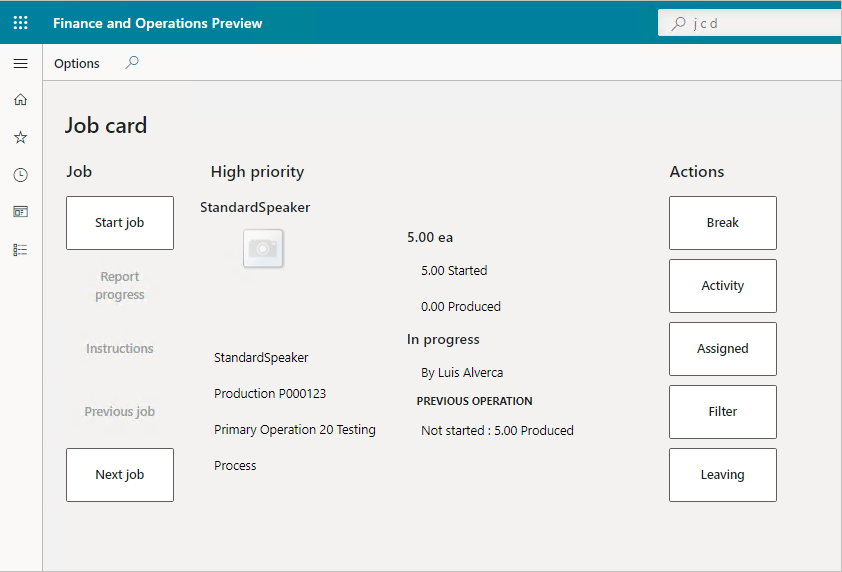
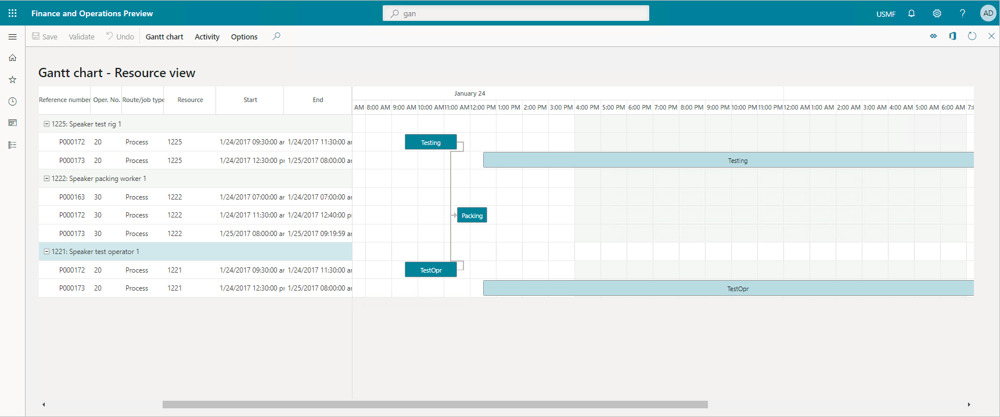

In the digital era we live in, the manufacturing industry is using AI machine learning and big data to become truly connected. Manufacturers are taking advantage of the latest technology to drive smarter processes and operations, such as using Internet of things (IoT) and mixed reality to optimize people, processes, and equipment.

Dynamics 365 Supply Chain Management allows you to realize the new efficiencies, innovations, and growth from digital transformation. It offers full functionality for the following types of manufacturing capabilities:

- **Production order:** You use a production order in discrete manufacturing, which is the classic order type to produce a specific product or product variant in a given quantity on a specific date. You base production orders on bills of materials (BOMs) and routes. A BOM is a comprehensive list of all the components, parts, raw materials, assemblies, and their quantities required to make a finished product.
- **Batch order:** You use a batch order for process manufacturing industries, where you base the manufacturing on a formulation or recipe, and where coproducts and by-products can be end products, either in addition to or instead of the main product. Batch orders use formulas and routes.
- **Kanban:** You use Kanban to signal repetitive lean manufacturing processes based on production flows, Kanban rules, and BOMs.

You can create best-fit manufacturing processes. You can use discrete, lean, process, and unified (mixed-mode) manufacturing processes to address your production requirements within a single solution.

Let's briefly define the different kinds of manufacturing.

## Discrete manufacturing

Discrete manufacturing is the production of distinct items. Automobiles, furniture, toys, smartphones, and airplanes are examples of discrete manufacturing products. Discrete manufacturers use a bill of materials (BOM) and production follows a route, such as an assembly line. Process manufacturing uses a recipe and manufacturers blend or refine the ingredients in batches.

The following are characteristics of discrete manufacturing:

- Order-based production or production in individual production orders.
- Varying sequence of work centers and complex routings.
- Semi-finished products often put into interim storage.
- Components staged with reference to order.
- Completion confirmation, or backflush, for individual operations or orders.
- Raw materials are measured in pieces.
- One product output.
- Waste can be accounted for on raw material lines only.
 
## Process manufacturing

Process manufacturing is common in the food, beverage, chemical, pharmaceutical, consumer packaged goods, cannabis, and biotechnology industries. In process manufacturing, the relevant factors are ingredients, not parts; formulas, not bills of materials; and bulk materials rather than individual units.

Organizations that want to automate their production processes for products manufactured in a batch, semi-continuous, or continuous processing environment can use process manufacturing.

The following are characteristics of process manufacturing:

- Uses a formula or recipe.
- Blends products together in a batch.
- Builds something that can't be taken apart.
- Product can't be reversed.
- Involves variable ingredients.
- Has product outputs such as coproducts and by-products.
- Make products in bulk quantities, such as paints, pharmaceuticals, beverages, and food products.
- Raw material ingredients in formulas are often measured by weight or volume instead of pieces.

## Lean manufacturing

Lean manufacturing is a method that focuses on minimizing waste within manufacturing systems while simultaneously maximizing productivity. Discrete manufacturing is often associated with lean manufacturing.

The following are characteristics of lean manufacturing:

- Waste minimization without sacrificing productivity.
- Takes into consideration waste created through overburden and waste created through unevenness in workloads.
- Emphasizes what adds value and reducing everything that doesn't add value.
- Derived from the Toyota Production System.
- Known for its focus on the original Toyota seven wastes. 

## Unified (mixed-mode) manufacturing

Different types of products require different manufacturing processes. Therefore, different products and production topologies require the application of different order types. 

Dynamics 365 Supply Chain Management enables the end-to-end process of producing one finished product, whatever the manufacturing process type.

The production of products, a process that is also known as the production life cycle, follows specific steps to complete the manufacture of an item. The life cycle begins with the creation of the production order in a discrete process, batch order in a process, or Kanban in a lean manufacturing environment.

Dynamics 365 Supply Chain Management delivers unified (mixed-mode) manufacturing to support all your manufacturing strategies, including:

- **Make-to-stock:** This principle is the classic manufacturing principle, where you produce products for stock, based on forecast or minimum stock refill. You calculate the latter based on forecast or historic consumption.
- **Make-to-order:** Standard products are made-to-order or finished-to-order. Although pre-production might be done by using the make-to-stock principle, you trigger expensive steps of the value chain, or steps that create variants, by a sales order or transfer order.
- **Configure-to-order:** As for the make-to-order principle, the final operations of the value chain are made-to-order. The actual product variant you produce isn't predefined, you create it at the time of order entry, based on the configuration model of the sales product. The configure-to-order principle requires a certain level of process unification for a given product line.
- **Engineer-to-order:** Engineer-to-order processes are a project and usually start with the engineering phase. During the engineering phase, you design the products required to fulfill the order. You can create production orders, batch orders, or Kanbans to produce the products.

Dynamics 365 Supply Chain Management speeds production by speeding the information flow. It enables you to stay on top of operations. The production floor management workspace gives users an overview of all jobs and progress in their area, complete with supporting links. They get capacity planning, production scheduling, and sequencing capabilities to control the factory floor effectively.

> [!div class="mx-imgBorder"]
>   
 
You can have an at-a-glance view of all production orders in the pipeline and critical on-hand inventory. You can also release all available orders at once or select the orders you need to prioritize.

You can view pending production orders through workspace tiles. Selecting the tiles displays production orders and release pages. You can check material availability before releasing orders to the factory floor.

Dynamics 365 Supply Chain Management makes it easy for you to stay up to date. You can review jobs with deviation that may call for further investigation. You have full visibility into the jobs your team is working on.

You can supervise staff, manage production jobs, and check progress on the floor. You have access to information to keep jobs moving and on schedule. The production floor management workspace gives you centralized access to processes and information. You can monitor staff attendance and check who is present or absent, and review other key information, such as the production orders you need to release.

Before releasing a production order, you can update the critical on-hand view of the materials needed for the order. With ready access to the requirement calculation of the production order, it’s easy to make the corresponding changes, if necessary.

Dynamics 365 Supply Chain Management can help you complete production orders quickly and efficiently. By using the job card device, you can access the workspaces and information you need to do the job. The employee signs into the device with a unique badge number. The system presents jobs in their scheduled order, but you can also review all jobs assigned to you.

> [!div class="mx-imgBorder"]
>   

The simple user interface is optimized for touch devices, making it possible to record data while working right from the manufacturing floor. You can confirm the requested quantity and adjust as needed. You can then submit a progress report as the work is done. When you complete the job, you sign out so person can take over on the device.

Successful organizations must understand the fulfillment cost of every order, and the cost of bringing each new product to market. They must know every detail of component and manufacturing costs. The product costing feature allows you to evaluate implications upfront. Each industry has its own item management demands, including traceability, routing, component dependencies, and valuation.

Dynamics 365 Supply Chain Management eases oversight of these factors and keeps supply chain operations optimized. It helps keep products moving beyond the factory floor. It supports effective accounting and forecasting, with detailed breakdowns of all production and material costs and variances including indirect costs as specified.

Gantt charts allow you to optimize production by making operations transparent. You can adjust schedules in lieu of material or resource shortages and make the best use of available resources to keep the lines moving.

> [!div class="mx-imgBorder"]
>   

Dynamics 365 Supply Chain Management connects production orders with the production floor. It gives you the complete flexibility of production control, enabling you to view and manage jobs on your lines, via mobile devices, or job card devices on the shop floor. Dynamics 365 Supply Chain Management can optimize your production through a digital feedback loop, giving you the ability to respond to market diversity.

Use Power BIs intelligent insights on production costs to promote optimum efficiency, and instantly scale routing to meet production demand. 

|  |  |
| ------------ | ------------- | 
|  | In this video, you'll learn about a discrete manufacturing scenario. |

> [!VIDEO https://www.microsoft.com/videoplayer/embed/RE4ieg0]

This video showed a common discrete manufacturing scenario by taking a production order through its full lifecycle.

Whether you use a discrete, process, lean, or mixed mode production, Dynamics 365 Supply Chain Management gives you the power to create and maintain a best-fit manufacturing process. 

Next, we'll take a look at Dynamics 365 Layout.
