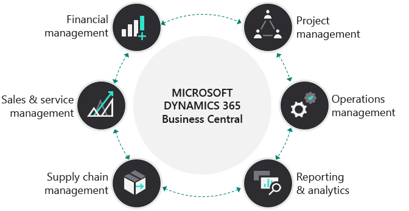

Small to mid-size organizations have needs that are similar, but less developed, than large enterprise organizations. Like their larger counterparts, they need solutions for financials, sales, service, operations, and supply chain management. However, they don't always have the bandwidth, resources, or budget to implement individual applications for each of these needs. Small to mid-size organizations need a single comprehensive solution that lets them review the overall picture, while managing the day-to-day activities including:

- Sales and order management.
- Finance and project operations.
- Supply chain management.

With Dynamics 365 Business Central, small to mid-size organizations can:

- Increase their overall visibility across all supply chains to gain control over purchasing processes.
- Maximize their revenue opportunities and serve customers better with built-in recommendations. 
- Manage budgets and monitor progress of projects with real-time data on available resources.
- Accelerate financial closing and report across any financial or business dimension while ensuring compliance.
- Streamline manufacturing and warehousing operations to deliver products on time and reduce costs.

The following graphic shows the different capabilities Business Central can offer to users.

> [!div class="mx-imgBorder"]
> 

Since every organization is unique, Dynamics 365 Business Central makes it easy for you to use third-party applications. The applications allow industry vertical-specific or targeted functional behaviors to further tailor your business including:

- Payroll.
- Banking.
- eCommerce.
- A variety of industry-specific solutions.

The *Microsoft AppSource* marketplace makes it easy to discover and select apps to extend and adapt Dynamics 365 Business Central for specific needs. 

The key features that Dynamics 365 Business Central offers includes:

* **Project management:** You can manage the development of new products at the start of the design, build, and sell cycle. 
* **Operations management:** You can control your operations while staying integrated with the rest of your organization.
* **Reporting and analytics:** You can monitor progress of projects with real-time data on available resources. You can apply this data to any part of your organization, like streamlining manufacturing and warehousing operations to deliver products on time.
* **Supply chain management:** You can increase visibility across your supply chains to gain greater control over purchasing processes.
* **Sales and service management:** You can maximize revenue opportunities and serve customers better with built-in recommendations.
* **Financial management:** You can accelerate financials, manage budgets, and report with accuracy while ensuring compliance.

Let’s review how Dynamics 365 Business Central works at the employee level.

## A solution for every department in the organization

Every employee does things depending on their roles. Accountants manage numbers, project managers keep jobs on budget, and sales managers monitor opportunities in the pipeline. When users sign into Dynamics 365 Business Central, they're taken to a home page for their role. You tailor home pages based on the roles in your organization and give access to the information, KPIs, and tools needed to be efficient in daily work. You can add and change role centers and tailor each center to the role of the intended users. For example, you might create role centers for the organization’s owners, department leads, and information workers.

Role centers in Dynamics 365 Business Central allow access to everyday tools while ensuring that all features are easy to access. All role centers have the same layout, but the tiles displayed in the activity section are different. This role-tailored experience helps users focus on the work that is important to them and increase overall productivity.

Now let's review how Dynamics 365 Business Central manages the finance functions.
