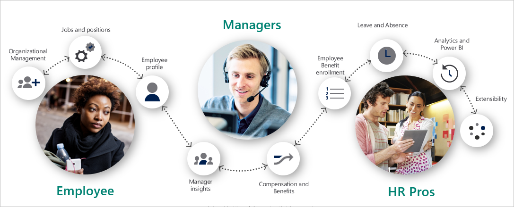
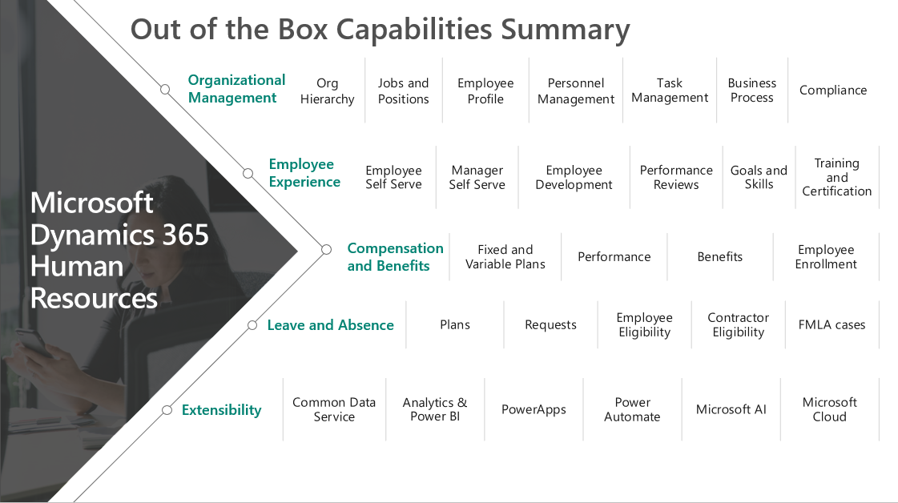

Dynamics 365 Human Resources helps you get the workforce insights you need to build data-driven employee experiences across the key HR functions, such as compensation, benefits, leave and absence, compliance, payroll, performance feedback, training and certification, and self-service programs. It connects people and operations data to ensure you can optimize workforce costs and take better care of your employees.

Dynamics 365 Human Resources streamlines routine human resources (HR) tasks and automates processes related to managing employees within your organization. It enables you to manage your personnel, compensation, benefits, leave and absence tracking, and competencies and development. Using them together, you set up your talent and organization for success. Dynamics 365 Human Resources also gives you a framework for your HR professionals to drive consistency, efficiency, and optimize processes.

Dynamics 365 Human Resources helps you drive better decisions by centralizing your workforce data and using embedded analytics to uncover valuable insights.

   

Dynamics 365 Human Resources allows you to manage human resources in a rich, browser-based user experience with workspaces tailored to specific roles.   

> [!div class="mx-imgBorder"]
>    

You can use Dynamics 365 Human Resources to complete the following tasks:

- Administer organizational structures.
- Maintain comprehensive employee information from hire to retire.
- Manage employee competencies.
- Define and administer benefit plans, enroll employees, assign dependent coverage, and designate beneficiaries.
- Establish and monitor absence policies.
- Implement and track profile-based time management and generate pay information to export to a payroll system.
- Review performance and implement employee goals.
- Set up, deliver, and analyze training courses that include agendas, sessions, and tracks.
- Track compliance (health and safety).
- Manage employee development (standardized training, certifications, skills tracking, performance feedback).
- Manage the employee and manager experience (self-service, manager dashboards, employee profiles).
- Complete HR reporting with embedded dashboards and Power BI for workforce analytics.
- Integrate payroll through Ceridian Dayforce.

## Organization management

You can structure your organization using elements such as departments, jobs, and positions. These elements are among the foundational elements that you'll configure. You assign individual employees to positions, which in turn are associated with jobs.

Positions are an essential element of the lower level of an organization hierarchy. A position is an individual instance of a job. For example, the position sales manager—east is one of the positions that is associated with the job, sales manager. A position exists in a department and may have only one worker associated with it.

- When you assign an employee to a position that reports to another position, you create a direct reporting relationship between the employees who are assigned to the two positions.
- If your organization uses a matrix hierarchy, as a manager you can set up position hierarchy types and then add reporting relationships to positions for each hierarchy type that you set up.
- Managers can transfer an employee for full-time employment or for contractual employment. The transfer can shift an employee to a different division, position, or change the employment terms like basic pay.

## Mobile interface

You can deploy Dynamics 365 Human Resources on any device that a runs browser, making it accessible to a wide range of mobile and desktop devices. The mobile interface enables you to do business anywhere, anytime, on any device, by offering a user interface that is consistent across devices and form factors.

##  Task-based mobile apps

With cloud service’s support for mobility, you can:

- Configure business processes with available apps.
- Do more with your data using customized in-house apps.
- Build native apps that focus on customer-facing needs. 

Activity-based mobile applications enable you to keep your workforce productive on their mobile device while they are on the go. Your employees can complete commonly repeated tasks. For example, they can create and edit appointments, update opportunity list, update contact records, and process and approve expenses via the first-party mobile apps on their preferred mobile device, keeping your employees efficient while on the go.
 
## Benefits of Dynamics 365 Human Resources

Dynamics 365 Human Resources helps you to:

- **Increase employee retention** by aligning people to affect and offering competitive compensation, benefits, and leave programs.
- **Reduce organizational complexity** with administration that accurately reflects organization structures, hierarchies, personnel records, and job descriptions.
- **Improve productivity and efficiency** with automated processes, workflows, and task management.
- **Personalize your solution** through an intuitive and customizable interface that allows you to add or hide fields, change the layout, and share with others.
- **Customize and extend** Dynamics 365 Human Resources using Microsoft Power Platform whatever of your level of technical ability.
- **Drive business performance** with the security, privacy, and compliance delivered by human capital management built on Microsoft Azure.
- **Innovate business models** to do local or remote point-of-sale from any device.
- **Innovate faster and easier** with an integrated finance and operations solution that is adoptable to your business needs and allows you to grow at your pace.

Dynamics 365 Human Resources helps you manage and develop you employees, with everything from guided learning experiences to performance assessments. You can create streamlined talent-centric processes and effective programs that optimize workforce costs, deliver business impact, and drive an agile, high-performance culture. You can set up and manage all your HR programs. Dynamics 365 Human Resources gives you capabilities to better manage:

- Personnel and organizational management.
- Benefits and compensation.
- Leave and absence management.
- Compliance (health and safety).

With the HR experience in Dynamics 365 Human Resources, you can:

- Create a 360-degree view of your employees that includes present and experience and data from Microsoft Office.
- Create collaborative experiences across candidates, employees, managers, and HR to reduce administrative tasks and free up time for more strategic initiatives. 
- Build configurable processes that drive the right action, by the right employee, at the right time.
- Simplify compliance to global regulations and safety and health requirements.

Dynamics 365 Human Resources capabilities simplify and optimize benefits, compensation, leave and absence, certifications and training, and compliance programs.

Next, let's take a look at employee self-service and personnel management.
