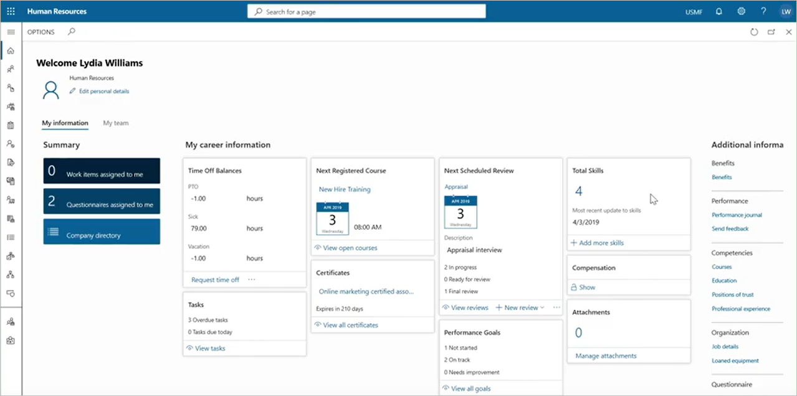
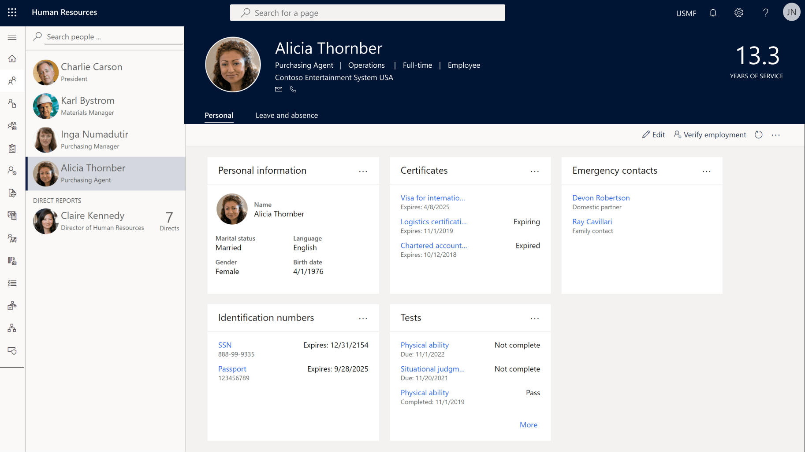
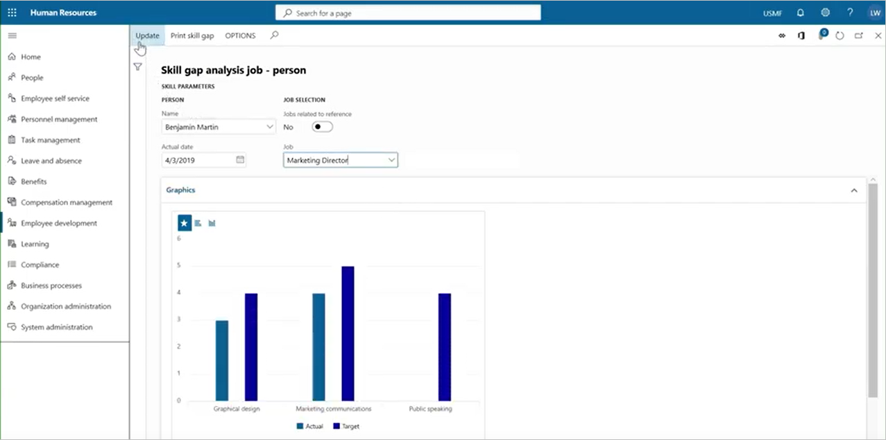
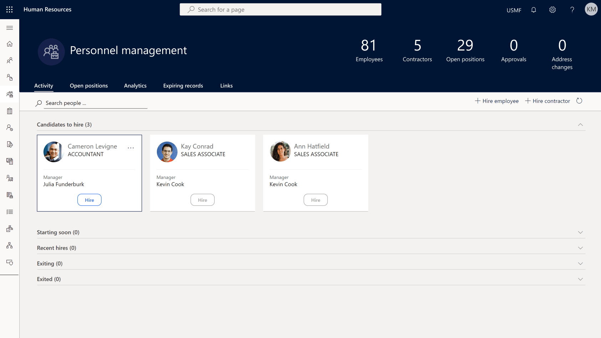

With Dynamics 365 Human Resources, you can accelerate employee growth and communication. By centralizing employee data, and enabling self-service in a flexible and extensible platform, your employees will be in control of their own profile. Self-service lets you put the power in the hands of employees and their managers, while reducing paperwork and creating an agile, high-performance culture. 

### Employee self-service

Dynamics 365 Human Resources transforms employee experiences by:

- **Giving you rich employee profiles** that include career accomplishments, skills, certifications, and interests.
- **Enabling employee self-service** to let employees manage profile updates, training, performance-tracking, and time-off requests.
- **Allowing HR managers to analyze team performance** to help optimize team impact and address any immediate concerns.

It helps employees get the information they need, all on their own, through easy-to-use self-service HR tools.

The following screenshot is the employee portal.

> [!div class="mx-imgBorder"]
> 

In the self-service workspace, employees create universal profiles that highlight their skills and competencies. 

Employees can self-register for the learning courses your HR staff created strategically. The key employee activities and achievements feed into the analytics that you use to measure success across individual, team, or organization-wide goals.

The following screenshot is the employee self-service workspace.

> [!div class="mx-imgBorder"]
> 

### Personnel management

Skill gap analysis is a valuable tool for managers and employees alike. Both need to learn about the skills required for different roles in the organization. 

The following screenshot shows the skill gap analysis screen.

> [!div class="mx-imgBorder"]
> 

You can find employees who possess the skills required for open roles, helping you fill vacancies from within quickly, learning and development across your entire organization.

The following screenshot shows the candidates screen.

> [!div class="mx-imgBorder"]
> 

The leave and absence management feature offers a flexible framework for defining the absence management process. You can create leave and absence plans to determine how employees accrue or are granted time off. After employees enroll in a plan, they can submit time-off requests for approval by managers. 

Leave tracking lets both first-level managers and HR managers see who is taking time-off, and how much time off each employee still has.

|  |  |
| ------------ | ------------- | 
|  | In this video, you'll learn about employee self-service and other Dynamics 365 Human Resources capabilities. |
 
> [!VIDEO https://www.microsoft.com/videoplayer/embed/RE4ieg5]
 
As you learned in the video, by centralizing employee data and enabling self-service in a flexible and extensible platform, your employees will be in control of their own profile.

Now, let's review at benefits management.
