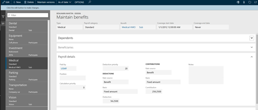

Dynamics 365 Human Resources helps you manage standard compensation activities, including defining fixed and variable compensation plans, and spot, cyclical, short-term, or annual bonuses. You can also manage long-term incentives, such as cash awards, stock awards, and stock options.

It provides a set of tools that you use to set up and maintain the benefits, deductions, and employees' compensation plans that you offer or processes for your employees.

The following graphic shows the benefits management process flow.

> [!div class="mx-imgBorder"]
>   

You use compensation management to control the delivery of base pay and awards. An employee's fixed base pay and merit increases are controlled through fixed compensation plans. You control the payment of incentive pay, including:

- Bonus payments
- Performance awards
- Stock options
- Grants

You control one-time awards through variable compensation plans.

The following screenshot shows the benefits management screen.

> [!div class="mx-imgBorder"]
> 

You can set up plans to manage compensation effectively and equitably, and manage items, such as computers or phones, that you lend to your employees. You can create fixed and variable compensation plans and define rules that apply the compensation plan to meet the criteria for that plan.

In addition to compensating your staff with wages, salaries, and bonuses, you can develop benefit programs such as health insurance and retirement plans. You can also manage benefits such as loan programs, in which you lend items, such as computers or phones, to your employees.

|  |  |
| ------------ | ------------- | 
|  | In this video, you’ll learn how the benefits management tool helps you improve accuracy and minimize compliance risk. |
 
> [!VIDEO https://www.microsoft.com/videoplayer/embed/RE4ieg3]

As you learned in the video, the benefits management tool helps you to improve accuracy and minimize compliance risk.

Now let's take a look at employee development.
