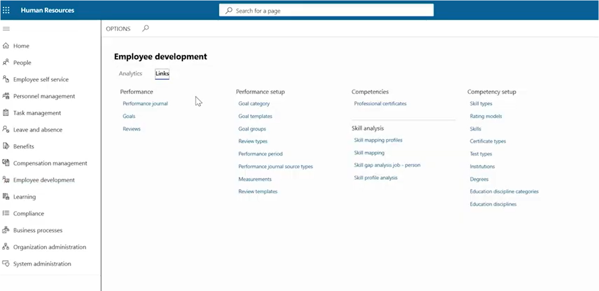
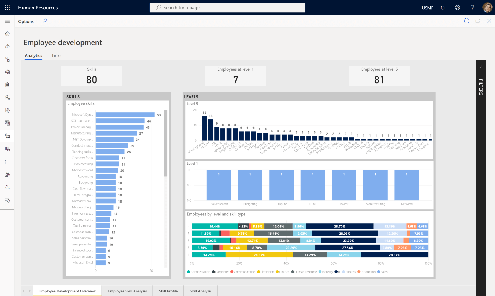
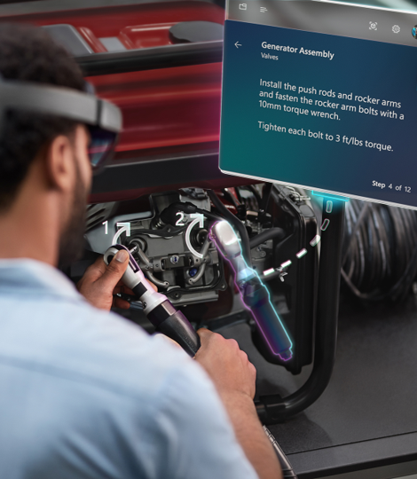

Dynamics 365 Human Resources helps you:

- Motivate employees to enrich their careers.
- Guide them to complete required training.
- Suggest professional development resources to drive future success.

You can use competencies in Dynamics 365 Human Resources to compare the skills, knowledge, or abilities defined for a job with the skills, knowledge, and abilities that employees have already obtained. You can track employees’ certificates, tests they've taken, and education they’ve completed. You can also examine current and future strategic needs, to help your employees shape their own objectives, and then find the training they need to develop the required competencies.

To help your employees reach their career goals, you can set up goals, create performance reviews, and track feedback. To help employees develop needed skills, you can also set up instructors, course types, courses, course descriptions, agendas, tracks, and sessions before you assign an instructor to a course, or register someone for a course. Instructors must already exist as employees, applicants, or contacts.

The following screenshot is the employee development screen.

> [!div class="mx-imgBorder"]
> 

You use the employee development workspace to set the broader goals and competencies for the entire business. You can design and share performance review templates across the organization. You can also gain a complete view of skills data across the organization that help you plan and make more informed decisions faster.

Rich, interactive analytics make it easy to find skills gaps and address them by creating learning courses designed to close those gaps.

The following screenshot shows employee development analytics.

> [!div class="mx-imgBorder"]
> 

You can design and administer questionnaires to gather information. When a questionnaire is ready, you distribute it broadly or to a specific set of respondents to complete. After the respondents supply their answers, you can review and analyze the results.

The performance management process lets employees document and discuss their performance with their manager. In turn, managers can then give feedback and guidance to employees.

### Dynamics 365 Guides

With Dynamics 365 Guides, you can enhance learning and standardize processes. It allows you to give step-by-step instructions that point employees to the tools and parts they need, and how to use them in real work situations. You can also integrate photos, videos, and 3D models to personalize the training. You can turn institutional knowledge into a repeatable, interactive learning tools.

You can then pull employee performance data into real-time Power BI dashboards. The data makes it easier for you to improve processes and find where instruction is needed.

> [!div class="mx-imgBorder"]
>    
    
> [!NOTE]
> for more information about Dynamics 365 Guides, see Module 8: Introduction to Dynamics 365 Field Service.

### LinkedIn Learning

Investing in your employees helps close skills gaps, build company advocates, boost quality of hire, and decrease time to hire. All these factors result in more efficient recruiting and lower hiring costs. LinkedIn Learning is the leading online learning platform that recommends expert-led courses to your employees, so they develop the most relevant, applicable skills.

|  |  |
| ------------ | ------------- | 
|  | The following video is an overview of Dynamics 365 Human Resources employee development features. |
 
> [!VIDEO https://www.microsoft.com/videoplayer/embed/RE4ieg2]

As you learned in the video, the employee development tools in Dynamics 365 Human Resources allow you to analyze your workforce, skills, and levels.

Now that you've been introduced to the core functionality of Dynamics 365 Human Resources, let’s see what you remember with a knowledge check.
