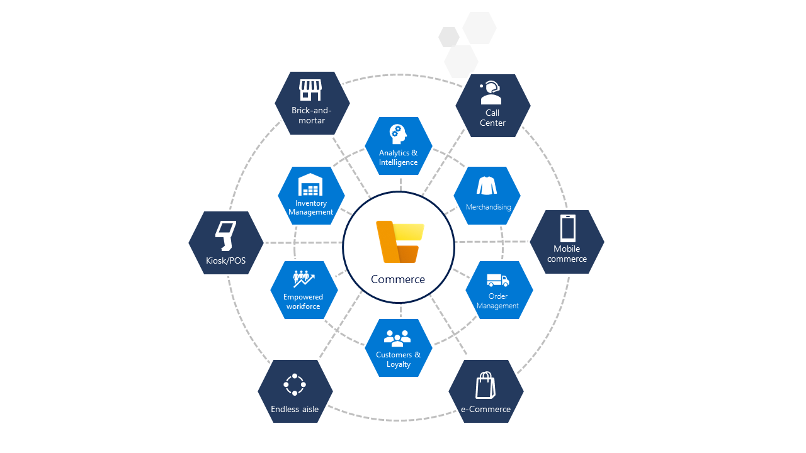

The modern retail customer is well informed and demands a great shopping experience. They want to feel in control their experience, from researching product price and quality, to purchasing from the brand that offers the most personalized, convenient service, to maximizing the value of every dollar spent. Their shopping journey can start in one channel, progress in another, and then end in a third channel of the customer’s choice.

To meet the customer’s demands, you need a solution that can:

- **Attract customers** with personalized experiences and streamlined store operations. 
- **Compete better** by helping your customers be nimble and build lasting relationships with them.
- **Create rich customer-first experiences** at all touchpoints tied with backend operations. 
- **Improve merchandising efficiencies** with intelligent insights.
- **Unify data** and take advantage of a data-driven approach.
- **Give your employees the tools and information** they need for ultra-responsive customer service.

To meet these requirements, you need a modern, flexible cloud commerce solution like Dynamics 365 Commerce. Dynamics 365 Commerce is a complete retail solution that gives you a unified experience across all channels. Dynamics 365 Commerce includes sales, mobility, intelligence, and productivity to help you achieve more in a cloud-first, mobile first way.

The following graphic shows the components of Dynamics 365 Commerce.

> [!div class="mx-imgBorder"]
> 

Connected commerce isn't just about delivering great customer experiences. By bringing together historically disconnected channels like physical stores, e-commerce, call centers, and emerging channels, you can break down the data silos of the traditional retail business. It allows you to use modern tools like machine learning and artificial intelligence (AI) to gain better business insights. With these insights you can drive an intelligent supply chain, support your employees, and deliver experiences that weren't possible a decade ago.

|  |  |
| ------------ | ------------- | 
|  | In this video, you'll learn about Dynamics 365 Commerce and the value it brings to your business. |
 
> [!VIDEO https://www.microsoft.com/videoplayer/embed/RE4dspC]

In this module, you'll: 

- Discover deployment options.
- Learn about point of sales systems.
- Explore omnichannel and merchandizing.

> [!NOTE]
> All data reflected in screenshots in this module is fictitious.

Next, we'll review the challenges faced by retail organizations and how Dynamics 365 Commerce can help address those challenges.
