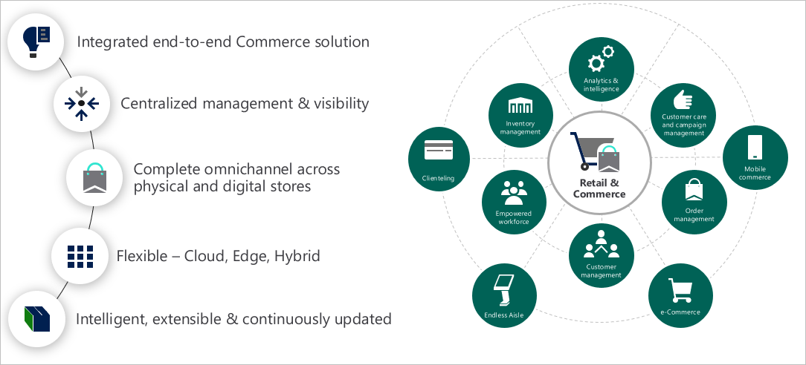
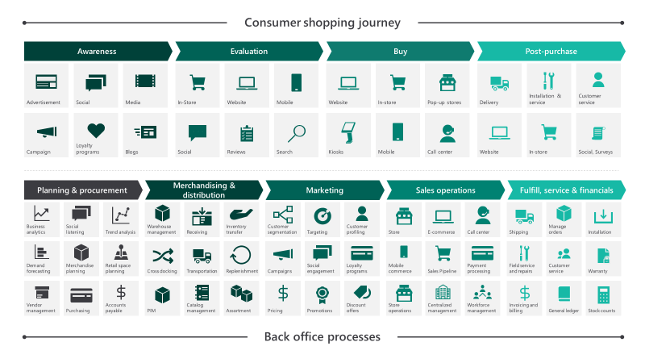
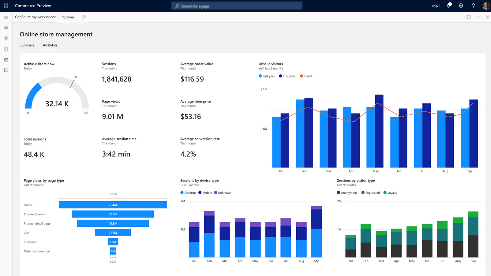

Let's start with on overview of Dynamics 365 Commerce. The retail industry is one of the most dynamic, revolutionary industries. It must be as technologically savvy, knowledgeable, and discerning customers create ever-increasing expectations of retail service.

Unified commerce is a fundamental shift in how technology supports the retail business. With unified commerce merging front-end and back-end systems into a single platform, technology is no longer a set of standalone, separate entities. Instead technology gives the retailer’s business a foundation and creates an agile system for delivering insightful, efficient service at every touchpoint.

Microsoft Dynamics 365 Commerce is a complete retail solution that delivers unified commerce across all channels. It includes sales, mobility, intelligence, and productivity, and helps you achieve more in a cloud-first manner.

The following graphic shows an overview of Dynamics 365 Commerce capabilities.

  

Dynamics 365 Commerce delivers a complete omnichannel solution that unifies back-office, in-store, and digital experiences with retail capabilities.

Dynamics 365 Commerce gives you integrated merchandising, inventory, order management, warehousing, and financials. Supporting this integration is artificial intelligence (AI) driven personalization, fraud protection, and search. In addition, Dynamics 365 Commerce supports Power Platform to deliver analytics and business workflow orchestration.

Dynamics 365 Commerce allows you to:

- Build brand loyalty through personalized customer engagements.
- Increase revenue with improved employee productivity
- Optimize operations to reduce costs and drive supply chain efficiencies.

In the modern retail environment, consumers are well informed and expect intuitive, engaging, and informative experiences when they shop. We call this situation connected commerce and it's best described as:

- Delivering great customer experiences with a true omnichannel solution.
- Allowing employees to deliver exceptional customer service.
- Strengthening strategic planning and merchandising practices.
- Integrating supply chain in all touchpoints.
- Unifying business processes across every channel.

The following illustration shows how Dynamics 365 Commerce capabilities support the modern customer journey.
 
> [!div class="mx-imgBorder"]
> 

Dynamics 365 Commerce offers comprehensive support for merchandising, inventory, and channel management. It also gives you immersive customer experiences across all touchpoints and scales to your needs across traditional and emerging channels.

**Everything to build and run digital commerce**

Built-in web authoring and development tools enable you to create engaging and intelligent digital storefronts. Connecting with Dynamics 365 Marketing creates an integration of assets, promotions, inventory, and pricing across all channels.

**Build loyalty and exceed customer expectations**

Meet your customer demand and deliver personalized, easy commerce experiences. The connected Dynamics 365 Marketing and Commerce platforms support management of content, assets, promotions, inventory, and pricing across channels.

**Flexible and intelligent omni-channel experience**

You can deliver easy and consistent yet unique engagement across online and offline channels. This engagement allows your customers to buy when, how, and where they want. It also gives them choices around modern payment methods and product delivery.

**Streamline operations using cloud intelligence**

Integrated, optimized back-office operations take advantage of built-in cloud intelligence technology. This intelligence helps you adapt to changing business needs and improve the quality of service and customer satisfaction. You can also use machine learning to help customers find products and services that meet their needs.

The following screenshot is the Dynamics 365 Commerce Analytics dashboard.

> [!div class="mx-imgBorder"]
>  

**Extensible, dependable, secure, and compliant**

Flexible deployment options allow you to meet your business needs supplying highly extensible and adaptable rollout options. Dynamics 365 adheres to global compliance and security standards.

Now let's review some key features.
