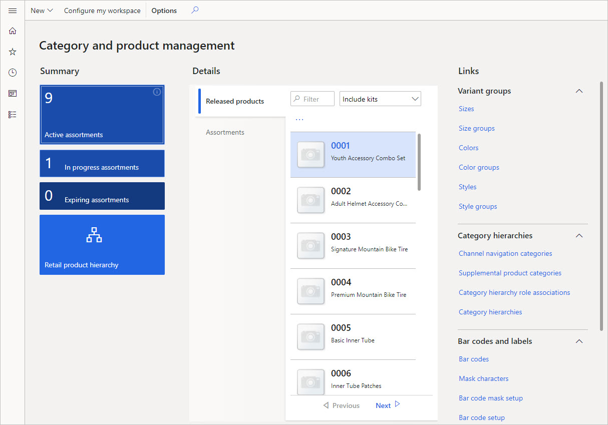
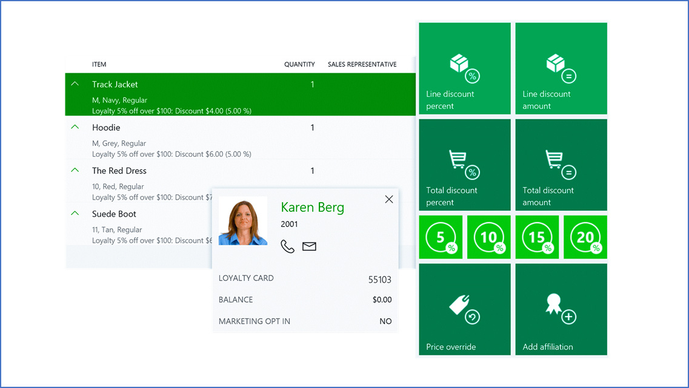

The following list is the key features of Dynamics 365 Commerce:

- **Unified commerce:** You can create unified shopping experiences across stores, web, mobile, and call centers.
- **Modern point of sale (MPOS):** MPOS is a point of sale (POS) app for devices. With MPOS, you can process transactions and orders from any device.
- **Merchandise management:** You can create and configure your product catalog before offering items for sale.
- **Customer loyalty:** You can track your customers' trends and habits and then send personalized notifications and offers that make shopping your channels easier.

Let's review the features one by one.

## Unified commerce

Retail organizations are no longer just brick and mortar stores. You need the ability to unify the shopping experience across all retail experiences. You must support diverse types of stores, including the traditional brick-and-mortar store, online stores, and call centers. Each store can have its own payment methods, delivery methods, price groups, income and expense accounts, registers, and staff. But across all the purchasing channels, you give customers the convenience and flexibility to buy-in store, pick up in other locations, or get home delivery with optimized ordering and fulfillment tools.

## Point of sale (POS)

You can support and manage your POS experiences with Dynamics 365 Commerce. You configure your operations across stores and online, while using intelligent product and inventory search tools. You create buttons for functional actions, process sales, and manage receipts after customers complete sales.

Dynamics 365 Commerce supports both cloud and MPOS experiences. Use the cloud POS on browsers with mobile devices, or use MPOS to process sales, orders, operations, and inventory across other devices. You can track and control commissions and receipts during and after sale events.

Dynamics 365 Commerce supports the following POS options:

- **Retail Modern POS (MPOS)** for Windows operating systems and mobile devices.
- **Cloud POS (CPOS)** that enables POS features in supported browsers.

In all cases, the POS shares the same core application code. This point is important for the following reasons:

- The user interface (UI) is consistent, whatever of the platform or form factor.
- Most of the capabilities are the same, whatever of the platform or form factor. However, there are some important differences. 
- In each, you can combine and run the POS variations concurrently. For example, for its main registers, you can use MPOS on devices that run Windows. However, you can supplement those registers with browser-based terminals or mobile devices.
- You can use customizations and extensions across platforms and form factors. Because the core application shares code, you can implement most customizations once instead of multiple times.

With Dynamics 365 Commerce, you can use wide range of devices with MPOS and CPOS. Both MPOS and CPOS offer multiple interfaces and deployment options to help you with your various business scenarios. 

The virtual peripheral simulator allows you to test physical peripheral devices without having to deploy the POS client. It includes both a virtual peripheral simulator and a POS simulator to test the compatibility of physical peripheral devices.

## Merchandising and inventory

You can strategically plan your merchandising and inventory to increase sales and profitability. Before you can offer products for sale in your retail channels, you must create and configure the products in Dynamics 365 Commerce. You create the products, define the product properties and attributes, and assign the products to retail category hierarchies. To make the products available to your retail channels and add them to an active assortment, you release the products to the legal entities where they're available.

You can change a product’s price and set up discounts applied to a line item or a transaction at the POS, in a call center sales order, or in an online order.

The following screenshot is the category and product management screen.

## Clienteling overview

You want your employees to form long-term relationships with your key customers. You expect the employees to know about these customers' likes and dislikes, purchase history, product preferences, and important dates, such as anniversaries and birthdays.

Employees need a place where they can capture and find this information. When information is available in a single view, your employees can target customers who meet specific criteria. For example, they can find all customers who prefer to shop for handbags, or customers who have a birthday or anniversary approaching.

With Dynamics 365 Commerce clienteling tools and integration with Dynamics 365 Customer Insights, you gain a comprehensive view of your customers. You can respond to their needs at every level of engagement, based on customer profile, history, and preferences that flow across physical and digital channels.

You can foster lasting relationships through AI-driven recommendations, customer insights, inventory checks, endless aisle, and loyalty programs that elevate brand appeal.

## Customer loyalty

Loyalty programs increase customer loyalty by rewarding customers for their interactions with your brand. In Dynamics 365 Commerce, you can set up loyalty programs that apply across your legal entities in any retail channel.

You can set up loyalty programs for the different reward incentives that you offer including:

- Defining earning rules to show the activities that customers must complete to earn rewards.
- Issuing loyalty cards from any retail channel that takes part in your loyalty programs.
- Linking loyalty cards to any loyalty programs that customers can take part in.
- Linking customers’ records to a loyalty card, so that the customers can pool loyalty points from multiple cards and redeem them.

The following screenshot shows the loyalty points a customer has accumulated.

 
Assisted selling in Dynamics 365 Commerce works across devices while harnessing the power of the cloud. You can create product recommendations across e-commerce and POS experiences. As customers interact with your store, they build up loyalty programs, which create loyal return customers. Finally, give your customers the ability to leave reviews and ratings so you can improve your processes for the future.

Now let's turn our attention to other Dynamics 365 Commerce capabilities.
