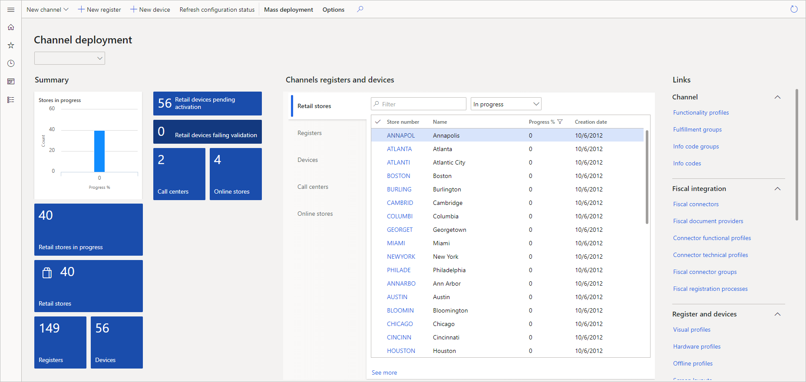

## Retail headquarters

You use the Dynamics 365 Commerce retail headquarters features to manage:

- Products and categories
- Catalogs and assortments
- Product recommendations
- Pricing and discounts
- Retail channels
- Employees
- Customers
- Inventory
- Orders
- Continuity programs
- Tasks
- Retail workflows

Let’s review each of these features.

- **Products and categories:** You use this feature to manage products, product kits, product images, product hierarchies, and supplemental product categories. 
- **Catalogs and assortments:** You use this feature to manage product assortments, catalogs, and catalog images. 
- **Product recommendations:** You use this feature to manage assisted selling and recommendation lists that you enhance with machine learning. 
- **Pricing and discounts:** You use this feature to manage product discounts, manage coupons, make price changes, and set up category price rules and price groups. 
- **Channels:** You use this feature to set up and manage retail stores, call centers, and online stores. It also allows you to review and compare channel financial statements.
- **Employees:** You use this feature to manage and assign employees to channels via address books and setup permission groups. 
- **Customers:** You use this feature to help you use Dynamics 365 Customer Service to create and manage customer orders, return and replacement orders, send catalogs, setup loyalty programs, and view customer transactions.
- **Inventory:** You use this feature to manage inventory on-hand and stock counts. You also use it to set up replenishment rules, product packages for merchandizing, barcodes and labels, and manage return locations and service categories.

## Merchandising and inventory

Before you can offer products for sale in your retail channels, you create and configure the products in Dynamics 365 Commerce. To create the products, you define the product properties and attributes, and assign the products to retail category hierarchies. You make the products available to your retail channels and add them to an active assortment. Then you release the products to the legal entities where they're available.

You can also make price changes to products or set up discounts applied to items or transactions across your sales channels.

## Channel management

You decide how to define and configure your stores, which can be brick-and-mortar stores, online stores, or call centers. Each store can have its own payment methods, delivery methods, price groups, income and expense accounts, registers, and staff. 

After you create your store, you create an assortment of products that you want the store to carry. You can also define store-specific prices and discounts that apply to products that are available in the store.

The following screenshot is the channel deployment screen.

## E-commerce

Dynamics 365 Commerce supports the management of catalogs, content, assets, promotions, inventory, and pricing across all channels. You can set up storefronts, manage content, and create catalogs of products for better sale experiences.

You can create layouts and templates with built-in web authoring and development tools. You can reuse rules and default content across a wide range of pages. You can then customize pages with themes and other page enhancements to give depth and richness to customer experience.

## Commerce deployment

Dynamics 365 Commerce gives you multiple options for package deployment. You can package separate packages for individual components, such as CPOS, store scale units, cloud scale units, and mobile considerations as a single retail deployable package.

Next, let's review Dynamics 365 Fraud Protection.
