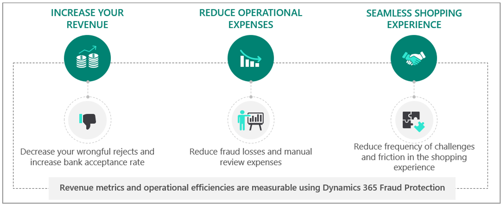
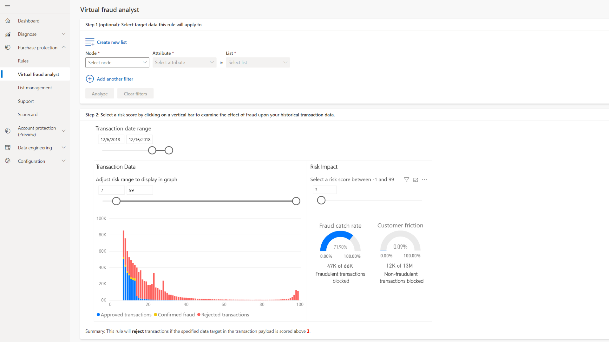
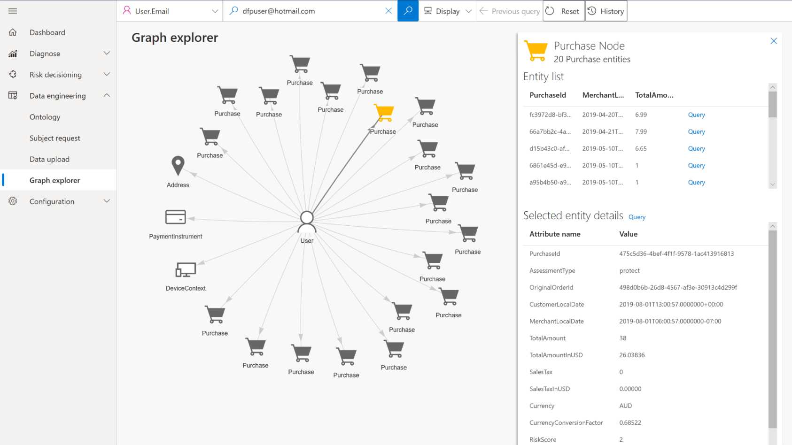
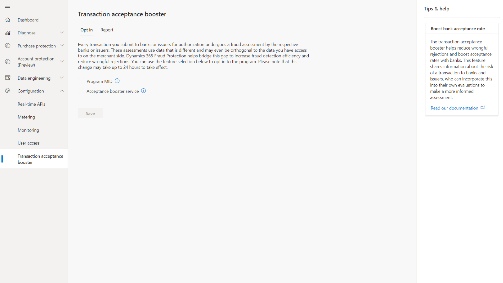

As a digital enterprise, you conduct business online and in real time. Although this approach helps you reduce costs and improve the customer experience, it also exposes you to serious threats of fraud. Sophisticated users take advantage of your online channel's relative anonymity and accessibility. For example, these users create transactions maliciously via compromised accounts and stolen payment instruments. Others try:

- Account takeover.
- Abuse of free trials.
- Fake product reviews.
- Warranty, refund, or reseller fraud.
- Abuse of program discounts. 

All these activities affect your profitability and reputation.

Some types of fraud even have profound consequences for society at large including money laundering and posting fake news.

Because online fraud is a substantial risk, it's likely that users can discover and exploit your vulnerabilities. Unlike during the early years of the internet, well-funded and well-equipped rings of professionals fund and orchestrate today's fraudulent transactions. Fraud protection professionals have the skills to fight this threat.

Dynamics 365 Fraud Protection focuses on payment fraud protection and related scenarios in e-commerce. It helps you:

- Drive down fraud loss.
- Increase bank acceptance rates to yield higher revenue.
- Improve the online shopping experience for its customers.

Microsoft has years of experience protecting our own e-commerce businesses from fraud. We've developed a sophisticated technology stack that uses connected big data across multiple lines of business. It applies artificial intelligence (AI) to help supply correct decisions in real time.

By using Dynamics 365 Fraud Protection, you can protect your business from fraud with innovative and advanced capabilities including:

- AI and insights from the fraud protection network.
- Device fingerprinting.
- A rules engine and virtual fraud analyst.
- A graph explorer and scorecard.
- A transaction acceptance booster.

You can use Dynamics 365 Commerce dashboards and historical data to create risk reports and weekly metrics that protect against fraud.

The following graphic shows the benefits of fraud protection.

> [!div class="mx-imgBorder"]
>  
 
### Adaptive AI technology

Dynamics 365 Fraud Protection continuously learns and adapts from patterns and equips fraud managers with tools to optimize fraud controls.

The following screenshot shows the Virtual fraud analyst screen.

> [!div class="mx-imgBorder"]
> 

### Fraud protection network

Dynamics 365 Fraud Protection learns and adapts continuously from patterns and equips you with tools to optimize fraud controls. The following screenshot is the virtual fraud analyst screen.

> [!div class="mx-imgBorder"]
> 

### Transaction acceptance booster

Connected knowledge gives broad awareness of fraud activity across the globe, while keeping the security of your confidential information and shoppers' privacy as a priority. The following screenshot is the graph explorer.

> [!div class="mx-imgBorder"]
> 

Now that you've been introduced to the core functionality of Dynamics 365 Commerce and Dynamics 365 Fraud Protection, let’s review what you remember with a knowledge check.
