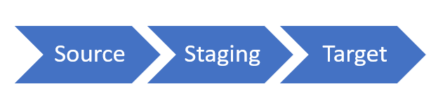

The data management framework is the key to managing data and data integrations in the Finance and Operations apps. It gives a comprehensive data toolset to manage, audit, import, export, and delete data.

The data management framework consists of three phases that reflect the data flow.

> [!div class="mx-imgBorder"]
> 

We based the data management framework on the concept of data entities. Most commonly, you use the framework to do data migration, configuration setup, and third-party system integrations. Data projects are part of the framework, which allows entities to send or receive data in Finance and Operations apps via a data job. Data projects also provide scheduling functionality, execution history, and error logging references.

## Data entity

A data entity is an object in a data model. You design data by breaking down things into the smallest parts that are useful for representing data relationships. For example, the vendor entity encompasses and combines over 17 different tables and data sources into a single vendor entity. During import or export events, entities use business logic to validate and transform the data being received or sent.

Finance and Operations apps also allow for custom data entities. A developer creates the data entities with Visual Studio.

There are five types of data entities, which categorize entities based on their function and data set. 

### Parameter

* Functional or behavioral parameters.
* Required to set up a deployment or a module for a specific build or customer.
* Can include data that is specific to an industry or business. The data can also apply to a broader set of customers.
* Tables that have only one record, where the columns are values for settings. Examples of these tables exist for accounts payable (AP), general ledger (GL), client performance options, workflows, and so on.

### Reference

* Simple reference data, of small quantity, which is required to operate a business process.
* Data that is specific to an industry or a business process.
* Examples include units, dimensions, and tax codes.

### Master

* Data assets of the business. These data assets are the nouns of the business, which typically fall into categories such as people, places, and concepts.
* Complex reference data, of large quantity. Examples include customers, vendors, and projects.

### Document

* Worksheet data that you convert into transactions.
* Documents that have complex structures, such as several line items for each header record. Examples include sales orders, purchase orders, open balances, and journals.
* The operational data of the business.

### Transaction

* The operational transaction data of the business.
* Posted transactions. These transactions are items such as posted invoiced and balances. Typically, you exclude these items during a full dataset copy.
* Examples include pending invoices.

Now let's review to how the Finance and Operations apps integrate with other Microsoft applications.
