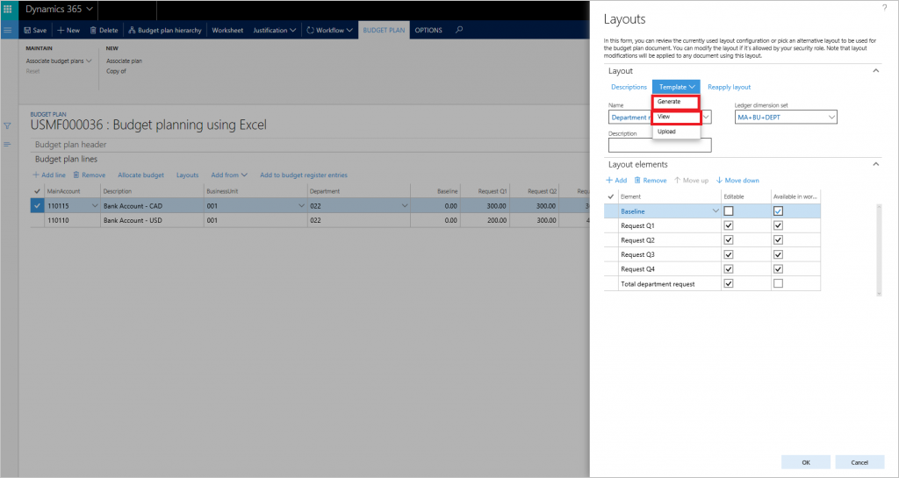
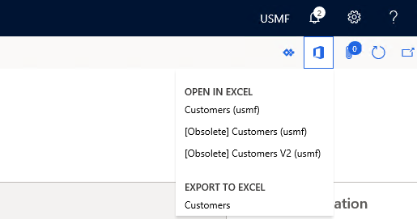

Microsoft Office integration capabilities give you a productive environment that helps you get the job done by using Office products such as Excel and Word. The key to this integration is the Microsoft Dynamics Data Connector add-in for Excel and Word. 

The data connector add-in uses the existing Dynamics 365 OAuth security protocol. It retrieves the application security roles for the current user to supply consistent permissions. This process allows for peace of mind, as sensitive data can’t be downloaded by users who don't have the proper permissions. The connector add-in app allows for full create, read, update, and delete operations on entities exposed as public.

Word and Excel are the most used business analysis applications. All Dynamics 365 apps have Microsoft Office integration capabilities. These templates span across all major system entities such as projects, products, customers, and a variety of journal entities. It's also possible to add additional templates or edit the existing templates. 

> [!div class="mx-imgBorder"]
> 

Let's consider an example of a custom template scenario. A department would like to download or upload data via Excel but needs additional fields in the Excel document. They also need a logo added. You can edit an Excel template by downloading the original template, redesigning it as desired, and then uploading the template with the exact same file name back to the templates section.

## Microsoft Office button

Accessing the predefined entity template from a screen requires selecting **Open Office** in the navigation section.

> [!div class="mx-imgBorder"]
> 

## Integrate with Excel

Now let’s examine the other ways you can integrate with Excel.

### Excel workbook templates and designer

You integrate data via the dynamics data connector add-in for Word and Excel. You use the Excel integrator for journal entry uploads and for small data uploads to common entities.

### Excel workbook designer

Finance and Operations apps have a simple-to-use interface to create Excel templates. It allows you to use data entities and the corresponding field definitions.

> [!div class="mx-imgBorder"]
> 

Finance and Operations apps display the associated templates based on the main entity displayed on the screen. For example, if you've displayed the all customers list page, the customer entity is the main and relevant entity. The drop-down list will display only customer-related templates.

> [!div class="mx-imgBorder"]
> 

### Publishing data via Excel add-in

To ensure you publish valid data via the Excel add-in, any updates pass through the existing OData entity logic validation. This validation ensures data integrity and provides you with immediate feedback of relevant error messages if a data publish was unsuccessful.

## Microsoft Outlook integration

Use the Outlook setup wizard to synchronize Outlook contacts, tasks, and appointments. The setup wizard will create and configure the relationship between a user, employee, and their Outlook account. It has parameters to configure the contact, task, and calendar integration. When complete, the system synchronizes the Finance and Operations apps and the user’s Outlook. For example, a newly created activity of type task will now show as a task in Outlook.

### Embedded Power BI in workspaces
Dynamics 365 applications deliver interactive reports that integrate into application workspaces. Using rich infographics and visuals supported by Power BI, workspaces give you a highly visual, yet interactive experience. Using infographics in the overview page, you can get a quick glance of the state of the business.

|  |  |
| ------------ | ----------- |
|  | In this video, you'll learn how embedded Power BI lets you use  Power BI to gain deeper insights into key financial analytics.|
 
> [!VIDEO https://www.microsoft.com/en-us/videoplayer/embed/RE4ijs0]

As you learned the video, you can view custom analytics from within Dynamics 365 Finance with embedded Power BI. You can filter visual elements from within the interface, and familiar Power BI tools are available.

Now let us turn our attention to how the Finance and Operations apps integrate with third-party applications.
