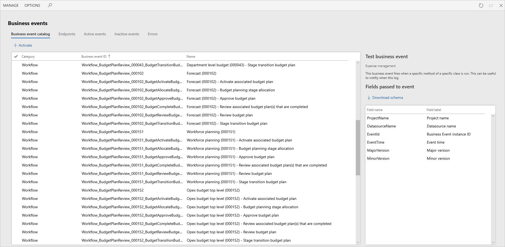

Business events are events generated in Finance and Operations apps and sent to an external system. The events are real time and they’re triggered as part of a larger business process. For example, you want to send a signal to your third-party warehouse system that a customer canceled a purchase order has. A developer can create a business event to send the signal upon cancelation.

You organize business events in the business event catalog.

To configure a business event, you must activate the event against an endpoint. To date, we support the following endpoints:

* Azure Service Bus Queue
* Azure Service Bus Topic
* Azure Event Grid
* Azure Event Hub
* HTTPS
* Microsoft Power Automate

We require the Azure-based endpoints to be in the customer’s Azure subscription and may incur added cost.

The business events screen also allows you to check any events that generate errors. It gives you the ability to resend those events.

Now that you've learned about how the Finance and Operations apps integrations, let’s see what you remember with a knowledge check.
